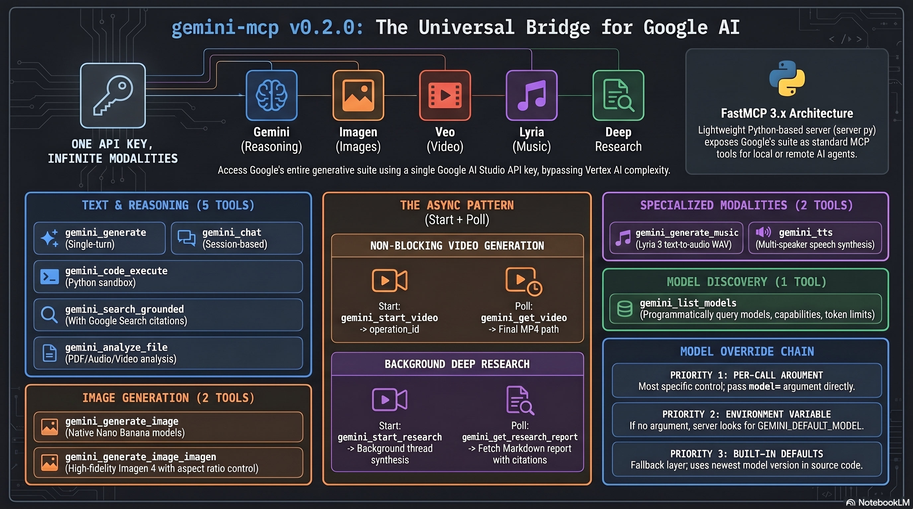

<div align="center">


# gemini-mcp

**Google Gemini, Imagen, and Veo, wired directly into Claude Code via MCP.**

[](https://www.python.org/)
[](LICENSE)
[](tests/)
[](https://gofastmcp.com/)
[](https://aistudio.google.com/)

13 MCP tools. Text, images, video, music, speech synthesis, deep research, code execution, multi-modal file analysis, and search-grounded answers, all from one API key.

[Quickstart](#quickstart) · [Features](#features) · [Model selection](#model-selection) · [Examples](#usage-examples) · [Limits](#known-limitations)

</div>

---

## Quickstart

One command to install with [`uvx`](https://docs.astral.sh/uv/) and register with Claude Code:

```bash
claude mcp add gemini -s user -e GEMINI_API_KEY=<your-key> -- uvx --from git+https://github.com/azmym/gemini-mcp gemini-mcp
```

Get your API key at [aistudio.google.com/app/apikey](https://aistudio.google.com/app/apikey). Then verify:

```bash
claude mcp list
# Expected: gemini: ... - ✓ Connected
```

That's it. Ask Claude Code to "list available Gemini models" and you're off.

## Why use this?

- **One MCP server, three Google model families.** Gemini 2.5/3 for text, multi-modal, and image generation, Veo 3.1 for video, all behind a single API key.
- **Google AI Studio only.** No Vertex AI account, no service accounts, no GCP project setup. One key and you're done.
- **Async video built in.** Veo generations run as long-running operations so the stdio server never blocks for minutes.
- **Model swapping per call.** Every tool accepts a `model` argument, so you can mix `gemini-2.5-flash` for quick answers with `gemini-3.1-pro-preview` for heavy reasoning in the same session.

## At a glance

<p align="center">
  
</p>

## Architecture overview

A 7-minute walkthrough of how Claude Code and Gemini communicate via MCP. Attached as a release asset (released with [v0.1.0](https://github.com/azmym/gemini-mcp/releases/tag/v0.1.0)):

https://github.com/azmym/gemini-mcp/releases/download/v0.1.0/gemini-mcp-architecture.mp4

## Overview

`gemini-mcp` wraps the Google AI Studio API as a set of MCP tools, making Gemini, Imagen, and Veo models directly callable from within Claude Code (or any MCP-compatible client). It supports single-turn text generation, native Gemini image generation, Imagen 4 image generation, asynchronous Veo video generation, Python code execution in Gemini's sandbox, Google Search-grounded responses, multi-modal file analysis, and persistent multi-turn chat sessions. No Vertex AI account or Anthropic API key is required.

## Features

| Tool | Default model | Purpose |
|---|---|---|
| `gemini_list_models` | n/a | Lists available Gemini models with capabilities and token limits |
| `gemini_generate` | `gemini-3.1-pro-preview` | Single-turn text generation with optional system prompt and sampling controls |
| `gemini_generate_image` | `gemini-3.1-flash-image` | Native image generation with Gemini Nano Banana; writes PNG files to a local output directory |
| `gemini_code_execute` | `gemini-3.1-pro-preview-customtools` | Gemini writes and runs Python in its sandbox; returns answer, code, and stdout |
| `gemini_search_grounded` | `gemini-3.7-flash` | Text generation grounded with Google Search; returns answer and citations |
| `gemini_analyze_file` | `gemini-3.1-pro-preview` | Uploads a local file (PDF, image, audio, video) via the Files API and answers a question about it |
| `gemini_chat` | `gemini-3.7-flash` | Multi-turn chat keyed by `session_id`; state is held in memory for the server lifetime |
| `gemini_generate_image_imagen` | `gemini-3.1-flash-image` | DEPRECATED (Imagen 4 sunsets 2026-08-17): redirects to the flash-image path; use `gemini_generate_image` instead |
| `gemini_start_video` | `veo-3.1-generate-preview` | Kicks off a Veo video generation; returns an `operation_id` for polling |
| `gemini_get_video` | n/a | Polls a Veo operation started by `gemini_start_video`; writes the MP4 when done |
| `gemini_generate_music` | `lyria-3-pro-preview` | Generate music from a text prompt (Lyria 3) |
| `gemini_tts` | `gemini-3.1-flash-tts-preview` | Synthesize speech (single-voice or multi-speaker) |
| `gemini_start_research` / `gemini_get_research_report` | `deep-research-max-preview-04-2026` | Deep Research synthesis (polling pair) |

Every tool accepts a `model` parameter to override the default for that call. Set `GEMINI_DEFAULT_MODEL` to override every tool's default globally.

## Requirements

- Python 3.11 or later
- [`uv`](https://docs.astral.sh/uv/) for dependency management
- A Google AI Studio API key from https://aistudio.google.com/app/apikey

## Installation

Pick the approach that matches how you plan to use the server. Options A and B register the `gemini` MCP server with Claude Code; Option C is a manual standalone run for verification.

### Option A: install directly from GitHub (no local clone)

Best for most users. `uvx` fetches the repository, installs dependencies into an isolated cache, and runs the `gemini-mcp` entry point registered in `pyproject.toml`. Replace `<your-key>` with your Google AI Studio API key.

```bash
claude mcp add gemini -s user \
  -e GEMINI_API_KEY=<your-key> \
  -- uvx --from git+https://github.com/azmym/gemini-mcp gemini-mcp
```

On first invocation `uvx` clones the repo and installs `fastmcp` and `google-genai` (roughly 5 to 15 seconds cold start); subsequent calls are instant thanks to the uv cache. To upgrade to the latest `main`, run:

```bash
uvx --from git+https://github.com/azmym/gemini-mcp --refresh gemini-mcp --help
```

You can also pin to a specific tag or commit by appending `@<ref>`, for example `git+https://github.com/azmym/gemini-mcp@v0.2.0`. If upgrading from v0.1.x, check the [migration guide](docs/migration-v0.2.md) first — v0.2.0 changes the built-in default model for every tool.

<details>
<summary><b>Option B: run from a local clone (best for development)</b></summary>

Use this when you want to edit the code and iterate quickly. Replace `/path/to/gemini-mcp` with the absolute path where you cloned the repository.

```bash
git clone https://github.com/azmym/gemini-mcp
cd gemini-mcp
uv sync

claude mcp add gemini -s user \
  -e GEMINI_API_KEY=<your-key> \
  -- uv --directory /path/to/gemini-mcp run python server.py
```

Changes to `server.py` take effect the next time Claude Code restarts the MCP server.

</details>

<details>
<summary><b>Option C: standalone manual run (testing without Claude Code)</b></summary>

Launch the server directly to verify the environment is correct. The process speaks the MCP stdio transport and waits for a client to connect.

```bash
cd /path/to/gemini-mcp
GEMINI_API_KEY=<your-key> uv run python server.py
```

After registering with Option A or B, verify the connection:

```bash
claude mcp list
# Expected: gemini: ... - ✓ Connected
```

</details>

## Configuration

| Variable | Required | Description |
|---|---|---|
| `GEMINI_API_KEY` | Yes | Google AI Studio API key (https://aistudio.google.com/app/apikey) |
| `GEMINI_DEFAULT_MODEL` | No | Overrides the default model for every tool globally |

## Model selection

Every tool accepts a `model` parameter, so you can pick a different Gemini model for each call without changing any configuration. This is the recommended way to work with the server: defaults are tuned for the common case, and you override them only when a specific task benefits from a different model.

Resolution order, from highest to lowest priority:

1. The `model` argument on the individual tool call.
2. The `GEMINI_DEFAULT_MODEL` environment variable, if set.
3. The tool's built-in default (see the Features table above).

### Choosing per call

Pass `model` explicitly when you want a specific model for that call. The defaults stay untouched.

```text
Tool: gemini_generate
  prompt: "Explain CAP theorem in two paragraphs."
  model: "gemini-3.1-pro-preview"
```

```text
Tool: gemini_generate_image
  prompt: "Product photo of a wireless headset on a studio backdrop"
  model: "gemini-3-pro-image"
```

Call `gemini_list_models` to see every model your API key can access:

```text
Tool: gemini_list_models
```

### Common choices

| Goal | Model |
|---|---|
| Fast, cheap chat or short answers | `gemini-3.7-flash` |
| Strongest reasoning, code, analysis | `gemini-3.1-pro-preview` |
| Stable reasoning (no preview) | `gemini-2.5-pro` |
| Stable native image generation (Nano Banana) | `gemini-2.5-flash-image` |
| Latest native image generation (Nano Banana 2 / Pro) | `gemini-3.1-flash-image` (default) or `gemini-3-pro-image` |
| Imagen image generation (DEPRECATED, sunsets 2026-08-17) | redirects to `gemini-3.1-flash-image`; use `gemini_generate_image` |
| Video generation (Veo) | `veo-3.1-generate-preview` (default), `veo-3.1-fast-generate-preview`, `veo-3.1-lite-generate-preview` |
| Music generation (Lyria) | `lyria-3-pro-preview` (default) or `lyria-3-clip-preview` |
| Text-to-speech | `gemini-3.1-flash-tts-preview` (default) |
| Deep Research | `deep-research-max-preview-04-2026` (default) or `deep-research-pro-preview-12-2025` |
| Grounded answers with citations | `gemini-3.7-flash` |

Preview models can change behavior or availability without notice. Stick to the stable models for workflows you rely on; use previews for experimentation.

### Changing the global default

If you want one model everywhere without passing it on every call, set `GEMINI_DEFAULT_MODEL` on the MCP server entry. For Claude Code users, re-add the server with the extra env flag:

```bash
claude mcp remove gemini -s user
claude mcp add gemini -s user \
  -e GEMINI_API_KEY=<your-key> \
  -e GEMINI_DEFAULT_MODEL=gemini-3-flash-preview \
  -- uvx --from git+https://github.com/azmym/gemini-mcp gemini-mcp
```

Explicit `model` arguments on individual tool calls still win over the env var.

## Usage examples

### Analyze a PDF

Ask Gemini to read a local PDF and summarize it:

```text
Tool: gemini_analyze_file
  file_path: "/home/user/docs/report.pdf"
  prompt: "Summarize the key findings in three bullet points."
  model: "gemini-2.5-pro"
```

Example response:

```json
{
  "answer": "1. Revenue grew 18% year-on-year...\n2. Operational costs declined...\n3. Outlook for next quarter...",
  "file_uri": "files/abc123",
  "model": "gemini-2.5-pro"
}
```

Files uploaded via the Files API expire automatically on Google's servers after 48 hours.

### Generate image variations

Generate three product image variations from a prompt:

```text
Tool: gemini_generate_image
  prompt: "A minimalist product shot of a ceramic coffee mug on a white surface, soft natural light"
  output_dir: "/tmp/gemini-images"
  count: 3
```

Example response:

```json
{
  "paths": [
    "/tmp/gemini-images/gemini-1713380000-a1b2c3d4.png",
    "/tmp/gemini-images/gemini-1713380000-e5f6a7b8.png",
    "/tmp/gemini-images/gemini-1713380000-c9d0e1f2.png"
  ],
  "model": "gemini-3.1-flash-image"
}
```

### Search-grounded query with citations

Ask a question that benefits from up-to-date web data:

```text
Tool: gemini_search_grounded
  prompt: "What is the latest stable release of Python?"
```

Example response:

```json
{
  "answer": "As of April 2025, the latest stable Python release is 3.13.3...",
  "citations": [
    {"url": "https://www.python.org/downloads/", "title": "Download Python"},
    {"url": "https://docs.python.org/3/whatsnew/3.13.html", "title": "What's New in Python 3.13"}
  ],
  "model": "gemini-3.7-flash"
}
```

### Asynchronous video generation

Video generation takes 30 seconds to a few minutes. The server exposes a start-then-poll pattern so Claude can work on other tasks while waiting.

Step 1: start the operation.

```text
Tool: gemini_start_video
  prompt: "A calm drone shot of waves meeting a sandy beach at sunset"
  aspect_ratio: "16:9"
  duration_seconds: 5
```

Response:

```json
{"operation_id": "a1b2c3d4e5f6", "model": "veo-3.1-generate-preview", "message": "Video generation started. Poll with gemini_get_video."}
```

Step 2: poll until the status is `done`.

```text
Tool: gemini_get_video
  operation_id: "a1b2c3d4e5f6"
```

While running:

```json
{"status": "running", "operation_id": "a1b2c3d4e5f6"}
```

When complete:

```json
{"status": "done", "path": "/tmp/gemini-videos/veo-1776443060-ab12cd34.mp4", "operation_id": "a1b2c3d4e5f6"}
```

Poll every 10 to 15 seconds. Operation state is held in memory, so restarting the server invalidates any in-flight `operation_id` values.

## Available Gemini models

Call `gemini_list_models` to retrieve the full list of models your API key can access, along with supported actions and token limits:

```text
Tool: gemini_list_models
```

The server can use any model string accepted by the Google AI Studio API. At the time of writing, this includes Gemini 3.x preview models (such as `gemini-3.1-pro-preview`), Gemini flash-image for image generation, Veo 3.1 for video generation, Lyria 3 for music, Gemini 3.1 TTS for speech synthesis, and Deep Research for long-form synthesis. Pass the model name explicitly in any tool call to use a non-default model. (Imagen 4 model IDs are discontinued on 2026-08-17.)

## Development

### Setup

```bash
git clone https://github.com/azmym/gemini-mcp
cd gemini-mcp
uv sync --extra dev
```

### Running tests

Tests are fully offline: `google.genai` is mocked at the client boundary so no API key is needed.

```bash
uv run pytest
```

All 49 unit tests should pass. The test suite sets `FASTMCP_DECORATOR_MODE=object` via `tests/conftest.py` (see Known limitations below).

## Project structure

```text
gemini-mcp/
├── server.py          # All MCP tool definitions and the `main()` entry point
├── pyproject.toml     # Project metadata, dependencies, and `gemini-mcp` script
├── tests/             # 49 unit tests (offline, mocked)
└── docs/
    └── superpowers/
        ├── specs/     # Design specification
        └── plans/     # Implementation plan
```

The `gemini-mcp` console script is registered under `[project.scripts]` in `pyproject.toml` and points to `server:main`. This is what makes Option A above work: `uvx` installs the package, exposes the `gemini-mcp` command, and runs it.

<details>
<summary><b>Known limitations</b></summary>

- **Chat session state is in-memory.** All `gemini_chat` sessions are lost when the server process restarts. There is no persistence layer.
- **`gemini_list_models` has no `model` parameter.** On API error it returns `{"error": "...", "model": "n/a"}` rather than a model name, because no model is involved in the call.
- **Tests require `FASTMCP_DECORATOR_MODE=object`.** This environment variable (set in `tests/conftest.py`) enables a FastMCP v2 compatibility mode (deprecated in FastMCP 3.x) that allows tests to access `.fn` on decorated tool functions. This is a test-only concern and does not affect production behavior.
- **Google AI Studio only.** This server does not support Vertex AI. The `GEMINI_API_KEY` must be a Google AI Studio key.
- **Video operation state is in-memory.** `operation_id` values returned by `gemini_start_video` are invalidated when the server process restarts. Poll within a single server lifetime.
- **Image-to-video requires local files.** `gemini_start_video`'s `image_path` must point to a file readable by the server process.

</details>

## Contributing

Issues and pull requests are welcome. If you find a bug or want to propose a new tool, open an issue first to discuss the approach. For code changes, fork the repository, create a feature branch, and open a PR against `main`. Please include or update tests as appropriate.

## Further reading

- [Installation guide](docs/installation.md) - prerequisites, install options, upgrade, and verification
- [Configuration](docs/configuration.md) - environment variables and model resolution priority
- [Tools reference](docs/tools.md) - every MCP tool with parameters and example responses
- [Models](docs/models.md) - choosing between Gemini, Imagen, and Veo models
- [Migrating to v0.2.0](docs/migration-v0.2.md) - default model flips and pin recipes for v0.2.0

## License

MIT. See the [LICENSE](LICENSE) file for details.
